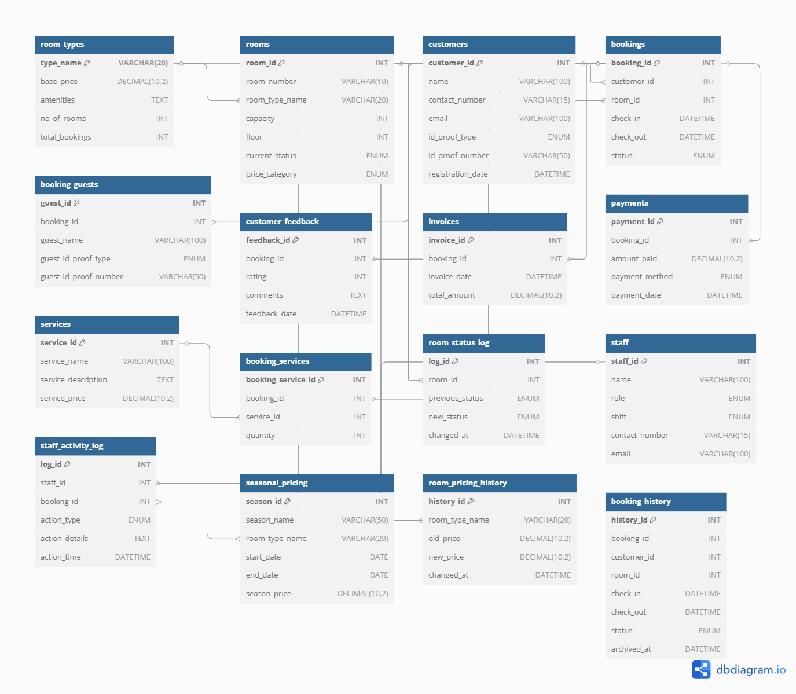

# Hotel Management System Database 

A complete **Hotel Management System Database** project in **MySQL**, designed as part of an internship assignment for Devify X — to demonstrate real-world hotel operations modeled via database design, business logic, and advanced reporting.

---

## 📂 Project Structure

| File                    | Purpose                          |
|-------------------------|----------------------------------|
| `schema.sql`            | Full database structure           |
| `data.sql`              | Sample data inserts               |
| `logic.sql`             | Triggers, Views, Procedures       |
| `reporting_queries.sql` | Advanced reporting SQL queries    |
| `README.md`             | Project documentation             |
| `ER_Diagram.png`        | Visual ER Diagram                 |

---

## 🗺️ ER Diagram

---

## 🚀 Features Implemented

- Room types & seasonal pricing
- Real-time room availability & status tracking
- Bookings (multi-guest support)
- Invoice & payments (auto-calculated via view)
- Room services & billing
- Staff activity logs
- Customer feedback system
- Booking history archive
- Dynamic reporting queries for managers

---

## 📋 Core Processes Explained

### 🏨 Check-in / Check-out Flow

- `bookings.status` tracks **check-in** and **check-out**  
- Trigger `booking_status_update` inserts status change logs  
- Trigger `total_bookings_update` tracks room type popularity  
- `rooms.current_status` updated in sync with booking status

### 💰 Pricing & Invoicing Flow

- Base pricing from `room_types.base_price`  
- Adjusted by `seasonal_pricing`  
- Invoices generated per booking in `invoices`  
- Payments logged in `payments`  
- View `view_invoices_paid` auto-computes current balance

---

## 📊 Reporting Queries

Provided in `reporting_queries.sql`:

Available rooms for a date range

1️⃣ Available rooms for a date range

2️⃣ Occupancy rate per room type / per month

3️⃣ Total revenue by season or date range

4️⃣ Bookings with outstanding payments

5️⃣ Top 5 customers by number of bookings or spend

6️⃣ Staff who performed check-ins on a specific day

7️⃣ Rooms reserved but not yet checked-in

8️⃣ Services used per booking (with total charges)

9️⃣ Customers with full payments and good feedback (Top Customers)
  

---

## 🖥️ How to Run

1️⃣ Run `schema.sql` → creates tables  
2️⃣ Run `logic.sql` → creates triggers, views, procedures  
3️⃣ Run `data.sql` → inserts sample data  
4️⃣ Run `reporting_queries.sql` → test reporting queries  

---

## 💻 Tech Stack

- MySQL 8.x  
- SQL (DDL, DML, Triggers, Views, Procedures)

---

##  Notes

- Comprehensive Database structure
- Includes full ER diagram (PNG)  
- Covers core hotel management processes  
- All reporting queries implemented  
